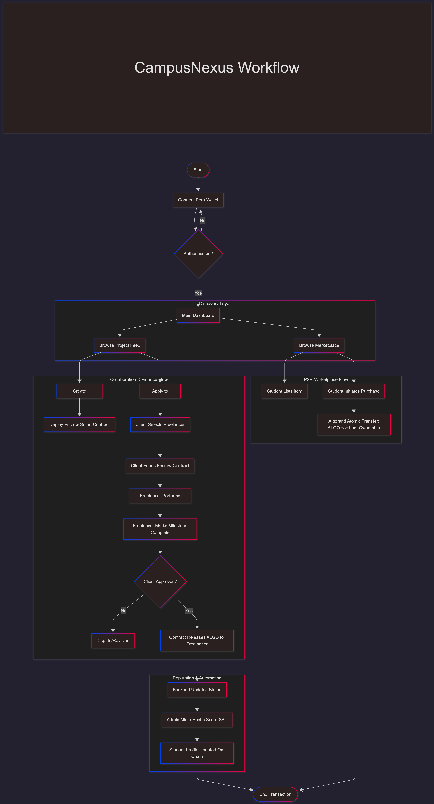

# CampusNexus - Decentralized Campus Ecosystem

**CampusNexus** is a decentralized platform designed for **VIT Pune**, enabling students to collaborate, trade, and build their on-chain professional reputation. It leverages the **Algorand** blockchain to provide a trustless environment for student interactions.

---

## Key Features

*   **AI Skill-Matcher**: Connects students with complementary skills for hackathons and projects using AI-driven matching.
*   **MilestoneEscrow**: A smart contract-based escrow system that ensures fair payments for freelance work. Funds are released only when milestones are approved.
*   **Hustle-Score**: An on-chain reputation system. Successful collaborations and completed projects increase a student's score, unlocking badges and opportunities.
*   **Student Marketplace**: A peer-to-peer marketplace for trading campus essentials (books, electronics, etc.) using ALGO or stablecoins.
*   **Soulbound Tokens (SBTs)**: Non-transferable tokens that certify achievements, roles (e.g., "Core Committee Member"), and skills.

---

## Workflow



---

##  Tech Stack

*   **Blockchain**: Algorand (PyTeal / Beaker / AlgoKit)
*   **Frontend**: React, Vite, TailwindCSS
*   **Backend**: Python (FastAPI)
*   **Wallet**: Pera Wallet, Defly, Exodus (via `use-wallet`)
*   **Storage**: IPFS (via Pinata) for NFT metadata and project assets.

---

## Project Structure

```text
.
├── .algokit/                # AlgoKit configuration, templates, and generators
├── .github/workflows/       # CI/CD pipelines for contracts and frontend deployment
├── projects/
│   ├── backend/             # FastAPI Backend Service
│   │   ├── app/
│   │   │   ├── models/      # Data models (User, Notification, etc.)
│   │   │   ├── routers/     # API Endpoints (AI, Auth, Escrow, Marketplace)
│   │   │   ├── services/    # Business logic (AI matching, Algorand integration)
│   │   │   └── utils/       # Database and utility helpers
│   │   ├── data/            # Local JSON storage for users and projects
│   │   └── requirements.txt # Python dependencies
│   │
│   ├── contracts/           # Algorand Smart Contracts (Python/Puya)
│   │   ├── smart_contracts/ # Logic for Escrow, Marketplace, HustleScore, etc.
│   │   ├── tests/           # Pytest suite for contract validation
│   │   ├── poetry.lock      # Dependency lock file
│   │   └── pyproject.toml   # Project configuration and dependencies
│   │
│   └── frontend/            # React + TypeScript Frontend
│       ├── src/
│       │   ├── components/  # UI Components (Feed, Marketplace, Wallet, etc.)
│       │   ├── hooks/       # Custom React hooks (Auth, Escrow, PeraWallet)
│       │   ├── services/    # Integration logic for API and Blockchain
│       │   ├── contracts/   # Auto-generated contract clients
│       │   └── styles/      # Global CSS and Tailwind configurations
│       ├── public/          # Static assets
│       ├── package.json     # Node.js dependencies and scripts
│       └── vite.config.ts   # Vite build configuration
│
├── README.md                # Project overview and documentation
├── WALKTHROUGH.md           # Step-by-step guide for project features
├── Alokit_setup.md          # Environment setup instructions
└── VERIFY.sh                # Script for project verification/testing
---
```
## Quick Start

### Prerequisites
*   [Docker](https://www.docker.com/) (must be running)
*   [Node.js](https://nodejs.org/) (v18+)
*   [AlgoKit](https://github.com/algorandfoundation/algokit-cli)

### Troubleshooting

*   **Python 3.14 Users**: If `algokit project bootstrap all` fails due to `coincurve` build errors, you can skip the contract build step if you are only working on the frontend/backend. The necessary artifacts have been pre-generated for you.
*   **Marketplace Contract**: A placeholder contract has been restored to `projects/contracts/smart_contracts/marketplace`.

### Installation

1.  **Bootstrap the Project** (Installs dependencies for all components):
    ```bash
    algokit project bootstrap all
    ```
    > **Note:** If `bootstrap all` fails for the backend, navigate to `projects/backend` and run:
    > ```bash
    > python -m venv venv
    > source venv/Scripts/activate  # Windows
    > pip install -r requirements.txt
    > ```

2.  **Start LocalNet** (Runs a local Algorand blockchain):
    ```bash
    algokit localnet start
    ```

3.  **Deploy Contracts & Build**:
    ```bash
    algokit project run build
    ```

4.  **Run the Backend**:
    ```bash
    cd projects/backend
    # Activate venv if not active
    uvicorn app.main:app --reload --port 8000
    ```

5.  **Run the Frontend**:
    ```bash
    cd projects/frontend
    npm run dev
    ```

---

## Verification

To audit the technical health of this repository (LocalNet status, dependencies, environment variables), run the included verification script:

bash
./VERIFY.sh


---

## Walkthrough

Want to see CampusNexus in action? Read the narrative walkthrough:
* [**WALKTHROUGH.md**](./WALKTHROUGH.md)

---

## Team Amateur

*   **Aditya Gavane** - Backend & Blockchain Architecture
